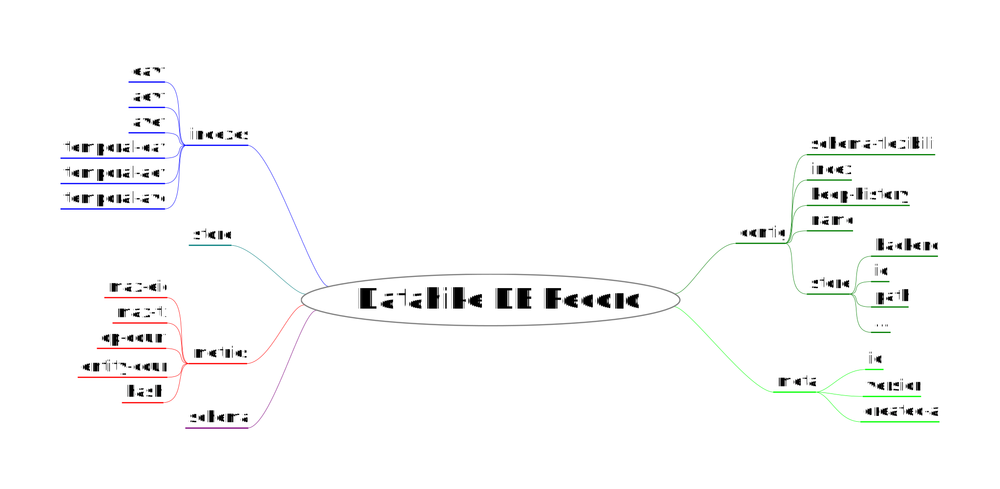

# DB record cleanup and specification 

## Context

The database record `DB` from `datahike.db` has too many fields. Extending the record with new fields is tedious and not clearly defined. 
Each change requires updating the `IConfiguration` from `datahike.connector` where the store is updated and a new `DB` record is written.

## Options

### Refactoring

Adjust the database record `DB` and combine fields into categories. Proposed fields:

- `indexes`: all index nodes
- `config`: as it is now with cleanup
- `meta`: fixed meta data created by Datahike like `:id`, `:created-at`, `version`
- `metrics`: db metrics like `max-eid` or `op-count`
- `schema`: cleaned schema data, reverse schema can be computed
- `store`: konserve store connected Datahike is connected to

Additionally simplify `DB` copy process after connections and transactions.

#### Pro

- unified and cleaner DB record
- more extensible through nested structures
- creates prerequisits for future metrics and additional meta data like migration history that needs to be stored in the record 

#### Contra

- possibily breaking changes if not every old field is mapped to the new implementation
- migration path adds more friction
- a lot of documentation needs to be adjusted
- refactoring needs to be done on sensitive code (`datahike.api`, `datahike.connector`, `datahike.db`)

### Extension

Instead of refactoring all new fields should be added into categories as proposed in the first [option](#refactoring).

#### Pro

- only little impact to existing versions
- no refactoring necessary

#### Contra

- unclear how `DB` fields relate to each other
- mixed `DB` fields with categories and plain fields
- `datahike.connector` extensions more complex due to complex `DB` copy code

## Status

**OPEN**

## Decision

**UNDECIDED**

## Consequences

